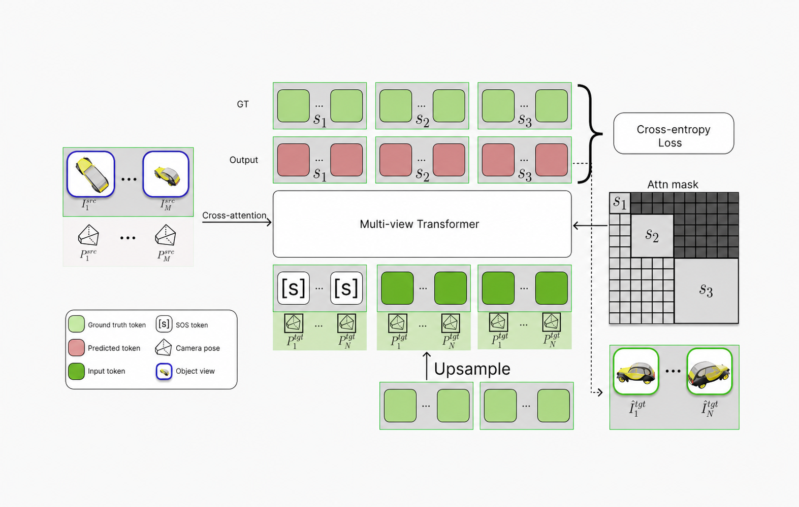

# NAMVIS: Next-Scale Autoregressive Multi-View Image Synthesis

Ramil Khafizov, Ilya Statsenko, Ruslan Rakhimov, Artem Komarichev,
Peter Wonka, and Evgeny Burnaev.

[Paper](https://openreview.net/forum?id=dTzafRJOTR) ·
[Project page](https://smileyenot983.github.io/namvis/) ·
[Code](https://github.com/smileyenot983/namvis) ·
[Dataset Part 1](https://huggingface.co/datasets/smileyenot983/objaversexl_sketchfab_pmap) ·
[Dataset Part 2](https://huggingface.co/datasets/smileyenot983/objaversexl_github6.5_pmap) ·
[Checkpoints](https://huggingface.co/smileyenot983/NAMVIS)

NAMVIS generates novel views at unseen camera poses from sparse posed source
images. It predicts target-view image tokens from coarse to fine, with
projective pose encoding at each scale and pooled and dense source-view
conditioning. This repository includes training, inference, and evaluation
on rendered multiview scenes.



## Installation

Run the examples below from the repository root. The current environment uses
Python 3.10, PyTorch 2.5.1, torchvision 0.20.1, CUDA 12.1, and
FlashAttention 2.8.3.post1. Training and inference require an NVIDIA GPU;
the current inference implementation does not support CPU-only execution.
Use a GPU supported by [FlashAttention-2](https://github.com/Dao-AILab/flash-attention/tree/v2.8.3#nvidia-cuda-support).

### Docker

Install Docker with the Compose plugin and configure GPU access using the
[NVIDIA Container Toolkit](https://docs.nvidia.com/datacenter/cloud-native/container-toolkit/latest/install-guide.html).
See also [Docker's GPU setup guide](https://docs.docker.com/compose/how-tos/gpu-support/).

Before starting, edit [docker/docker-compose.yaml](docker/docker-compose.yaml):

- Set the host repository path under `volumes` to your clone of this repository.
- Set the host dataset path under `volumes` to your dataset directory.
- Set `device_ids` to the GPUs you want to use, for example `["0"]` or
  `["0", "1"]`. Each GPU ID must be a separate list entry.

Keep the container mount destinations `/workspace/namvis` and `/workspace/data`.
Pass your host user and group IDs when building so that generated files belong
to your user:

```bash
env UID="$(id -u)" GID="$(id -g)" \
  docker compose -f docker/docker-compose.yaml up -d --build
docker compose -f docker/docker-compose.yaml exec -w /workspace/namvis namvis bash
```

Inside the container, make the repository available to Python:

```bash
export PYTHONPATH="$PWD${PYTHONPATH:+:$PYTHONPATH}"
```

Run the remaining examples inside this shell. To stop the container, run this
command on the host:

```bash
docker compose -f docker/docker-compose.yaml down
```

### Native installation

The following example mirrors the Docker dependencies; it has not yet been
validated in a fresh native environment. Install a CUDA 12.1 toolkit with
`nvcc`, a C++ compiler, Git, and FFmpeg before installing FlashAttention.

```bash
conda create -n namvis python=3.10 -y
conda activate namvis
python -m pip install --upgrade pip
python -m pip install packaging ninja psutil setuptools wheel
python -m pip install torch==2.5.1 torchvision==0.20.1 \
  --index-url https://download.pytorch.org/whl/cu121
python -m pip install -r docker/requirements.txt
MAX_JOBS=4 python -m pip install flash-attn==2.8.3.post1 --no-build-isolation
export PYTHONPATH="$PWD${PYTHONPATH:+:$PYTHONPATH}"
```

The PyTorch command follows the [official installation instructions for 2.5.1](https://pytorch.org/get-started/previous-versions/#v251).
Both installation methods use [docker/requirements.txt](docker/requirements.txt).
Its required packages and selected compatibility versions are pinned from the
running NAMVIS container (Python 3.10.12); PyTorch, torchvision, and
FlashAttention are installed separately at the versions shown above.
The examples use image conditioning and do not require CLIP.

## Checkpoints

The public [Hugging Face repository](https://huggingface.co/smileyenot983/NAMVIS)
contains both `namvis_1b.pth` and the matching visual tokenizer
`infinity_vae_d32reg.pth`. Download them with the `hf` CLI installed by
`huggingface-hub`:

```bash
hf download smileyenot983/NAMVIS namvis_1b.pth infinity_vae_d32reg.pth \
  --revision ba8f58ee46a7077af80dea4621239c9389435518 \
  --local-dir weights
```

This revision's file sizes and SHA-256 hashes match the local checkpoints
used by this repository. To verify the downloaded files:

```bash
sha256sum --check <<'EOF'
716b78418826e23e9f6498e89752370d7b6c7d7d79236f0b19a4549ce0a56247  weights/namvis_1b.pth
7a37fa3ea1b2a1ebd23de61d91a5e68202825e5a67edaef4b7c55f5fd5b9cf26  weights/infinity_vae_d32reg.pth
EOF
```

The resulting layout is:

```text
weights/
├── namvis_1b.pth
└── infinity_vae_d32reg.pth
```

The inference commands below pass both paths explicitly. T5 weights are not
needed for these image-conditioned examples or for the training launcher's
default `--online_t5=0` configuration.

## Inference and evaluation

The repository includes rendered Objaverse example scenes under
`data_eval/rendered_objaverse8_wdepth_pitch30/`. Each scene has a
`transforms.json` manifest and its referenced images. Frame indices refer to
positions in the manifest's `frames` list, starting at zero. Camera poses use
the Blender camera-to-world convention expected by the loader.

After installing the dependencies and placing the checkpoints, run one scene
with two source views and three target views:

```bash
python inference/infer_ext.py \
  --data_path=data_eval/rendered_objaverse8_wdepth_pitch30 \
  --model_path=weights/namvis_1b.pth \
  --vae_path=weights/infinity_vae_d32reg.pth \
  --model=1b --use_prope=1 --cos=0 --pn=0.06M \
  --N_views_src=2 --N_views_tgt=3 \
  --src_indices 0 3 --tgt_indices 1 2 4 \
  --cfg=1 --tau=0.5 --seed=0 --max_scenes=1 \
  --out_dir=inference_results/example \
  --grid_out_dir=inference_grid/example
```

Outputs include source images, ground-truth target images, generated target
images, and comparison grids. Calculate LPIPS, SSIM, PSNR, and pixel MSE with:

```bash
python inference/calc_metric.py --root=inference_results/example
```

To evaluate all combinations of one to three source views and one to three
target views on the bundled scenes, run:

```bash
MODEL_PATH=weights/namvis_1b.pth \
VAE_PATH=weights/infinity_vae_d32reg.pth \
EVAL_DATA_PATH=data_eval/rendered_objaverse8_wdepth_pitch30 \
  bash inference/infer_batched.sh
```

The batch script uses source indices `[0, 3, 7]` and target indices
`[1, 2, 4, 5, 6]`, taking the requested number from the start of each list.
It prints metrics for every combination and saves images under
`inference_results_namvis256/` and grids under `inference_grid_namvis256/`.

## Training

Training uses WebDataset TAR shards. The rendered evaluation folders are
examples for inference and evaluation, not training shards. Each training
sample contains view images and JSON camera metadata; see
[infinity/dataset/webdataset_utils.py](infinity/dataset/webdataset_utils.py)
for the expected sample format.

The project page links to training data on Hugging Face:

- [Dataset Part 1: ObjaverseXL Sketchfab](https://huggingface.co/datasets/smileyenot983/objaversexl_sketchfab_pmap)
- [Dataset Part 2: ObjaverseXL GitHub 6.5](https://huggingface.co/datasets/smileyenot983/objaversexl_github6.5_pmap)

Before launching, edit `data_path` in
[train_namvis.sh](train_namvis.sh) to point to your training
shards. It accepts comma-separated directories or shard paths. Update
`--train_scenes` to the scene count for your training data, and adjust the
batch size and worker settings for your hardware.
Training requires at least one DataLoader worker (`--workers >= 1`).

```bash
NPROC_PER_NODE=1 RUN_NAME=namvis_1b \
VAE_CKPT=weights/infinity_vae_d32reg.pth \
RUSH_RESUME=weights/namvis_1b.pth \
EVAL_DATA_PATH=data_eval/rendered_objaverse8_wdepth_pitch30 \
EVAL_JSON=data_eval/eval_objaverse_small.json \
  bash train_namvis.sh
```

This initializes transformer weights from the NAMVIS checkpoint with two
source views, three target views, image conditioning, and PRoPE enabled.
Set `NPROC_PER_NODE` to the
number of visible GPUs for single-node distributed training. To initialize
without a pretrained NAMVIS transformer, change `--rush_resume` to an empty
string in the launcher; the visual tokenizer checkpoint is still required.

Training writes checkpoints to `checkpoints/<RUN_NAME>/`, logs to
`local_output/<RUN_NAME>/`, and evaluation reports to
`outputs_<RUN_NAME>/evaluation/`. Trackio logs are stored in `trackio_logs/`.
See [data_eval/README.md](data_eval/README.md) for evaluation selections and
frequency settings.

`--save_model_iters_freq` sets the checkpoint interval in training iterations.
With gradient accumulation, saves wait until the next completed optimizer
update. Auto-resume restores full `*-last.pth` checkpoints; weights-only exports
are used through `--rush_resume` to initialize a new run.

## Acknowledgements

The implementation builds on [Infinity](https://github.com/FoundationVision/Infinity).

## License

The code is released under the [MIT License](LICENSE), including the upstream
Infinity copyright notice. Datasets and third-party assets retain their
respective licenses.

## Citation

```bibtex
@inproceedings{khafizov2026namvis,
  title     = {{NAMVIS}: Next-Scale Autoregressive Multi-View Image Synthesis},
  author    = {Khafizov, Ramil and Statsenko, Ilya and Rakhimov, Ruslan and Komarichev, Artem and Wonka, Peter and Burnaev, Evgeny},
  booktitle = {Advances in Neural Information Processing Systems},
  year      = {2026}
}
```
